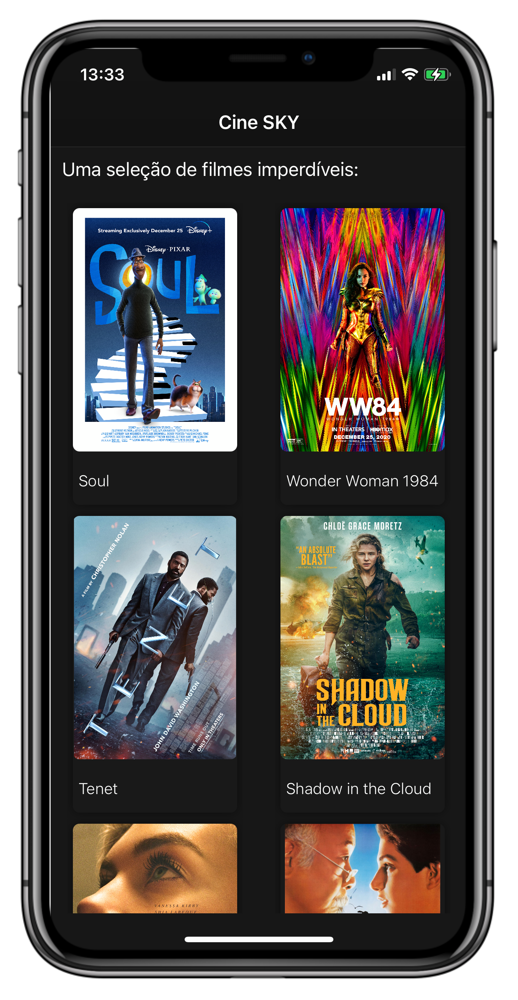
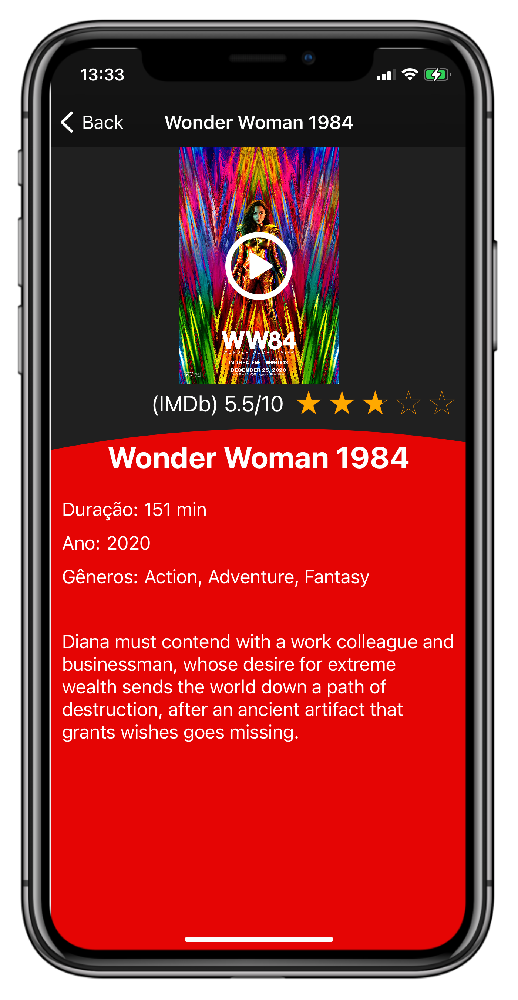
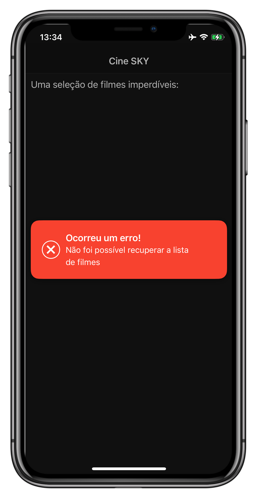

# Desafio Cine SKY Swift/iOS

## Objetivo:

Utilizar uma API do RapidAPI e realizar a implementação de duas APIs do "IMDb API” (https://rapidapi.com/apidojo/api/imdb8/endpoints):

1. **GET title/get-most-popular-movies**
   * Esta API retorna uma lista com os IDs dos filmes mais populares do IMDb.
2. **GET title/get-overview-details**
   * Esta API recupera os dados de cada filme para montar as telas de listagem e detalhe.

## API Service

Função para retornar a lista com os IDs do filmes mais populares do IMDb.

```swift
/// Retrieves the list with the most popular movie IDs
///
/// - Returns: `Result` Returns the result of the request
func getMostPopularMovies(completion: @escaping (Result) -> Void) {
  let url = baseURL.appendingPathComponent(mostPopularMoviesPath)

  let headers: HTTPHeaders = [
    "x-rapidapi-key": rapidapi_key,
    "x-rapidapi-host": rapidapi_host
  ]

  AF.request(url, method: .get, headers: headers)
  .validate(statusCode: 200..<300)
  .responseJSON { (response) in
        switch response.result {
            case .success(let json):
              let array = json as! Array<String>
              completion(Result.success(array))
            case .failure(let error):
              completion(Result.failure(error))
        }
    }
}
```


Função para retornar os detalhes do filme selecionado, a partir do seu ID.

```swift
/// Retrieves the details of the selected movie
///
/// - Parameter movieId: Selected movie ID
/// - Returns: `Result` Returns the result of the request
func getOverviewDetails(movieId: String, completion: @escaping (Result) -> Void) {
  let url = baseURL.appendingPathComponent(overviewDetailsPath)

  let headers: HTTPHeaders = [
    "x-rapidapi-key": rapidapi_key,
    "x-rapidapi-host": rapidapi_host
  ]

  let params: [String: Any] = [
    "tconst": movieId
  ]

  AF.request(url, method: .get, parameters: params, headers: headers)
  	.validate(statusCode: 200..<300)
  	.responseJSON { (response) in
         switch response.result {
            case .success:
              	do {
                  	let jsonDecode = try JSONDecoder().decode(Movie.self, from: response.data!)
                    completion(Result.success(jsonDecode))
                } catch let error {
                    completion(Result.failure(error))
                }
                break
             case .failure(let error):
                   completion(Result.failure(error))
             }
        }
}
```


## Telas

* LaunchScreen do aplicativo:


* Tela inicial do app:
  * Recupera a lista de IDs dos filmes e para cada célula do CollectionView é feita uma requisição para obter os detalhes do



* Tela de detalhe do filme:
  * Recupera os dados filme e insere na tela.
  * Recupera o link da imagem e o link do vídeo para poder ser exibido no player de vídeo.



* Tela inicial quando não consegue recuperar a lista de filmes, exibe um alerta e tenta buscar novamente os dados a cada 10 segundos.



